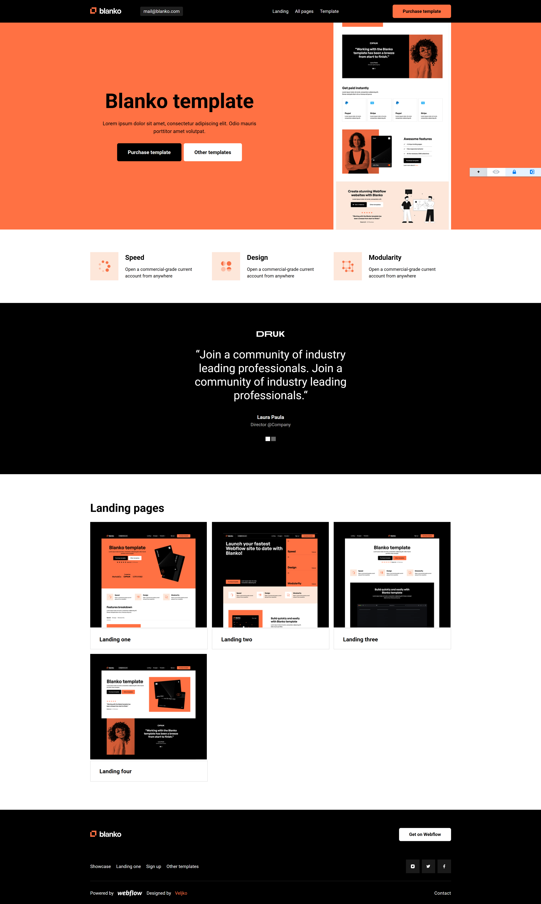

# Blanco

Элегантный лендинг-шаблон с чистой семантической разметкой и аккуратной версткой. Проект подойдет как стартовая точка для посадочных страниц, портфолио и промо.

## 🖼 Превью


## ✨ Основные возможности
- **Адаптивная сетка** на Flexbox с контейнером `1310px` и модульными блоками
- **Единый стиль**: кастомные свойства CSS (переменные), BEM-нейминг, `normalize.css`
- **Аккуратная типографика**: система заголовков и отступов, продуманная иерархия
- **Чистая структура**: разделение на секции `header / main / footer`, `figure/figcaption`
- **Готовность к улучшениям**: легко расширяется (медиа-запросы, состояния, темы)

## 🧱 Технологии
- **HTML5** — семантическая разметка
- **CSS3** — современные возможности, кастомные свойства
- **normalize.css** — нормализация стилей по браузерам

## 📁 Структура проекта
```
Blanco/
├─ index.html           # Разметка страницы
├─ style/
│  ├─ normalize.css     # Нормализация браузерных стилей
│  └─ style.css         # Основные стили проекта
├─ img/                 # Изображения и иконки
└─ font/                # Шрифты (рекомендуется woff2)
```

## 🚀 Быстрый старт
1. Клонируйте репозиторий:
   ```bash
   git clone https://github.com/your-username/Blanco.git
   ```
2. Откройте `index.html` в браузере (двойной клик или через локальный сервер).

Рекомендуется запускать через локальный сервер, чтобы корректно работала загрузка шрифтов/изображений.

### Варианты локального сервера
- VS Code: расширение `Live Server`
- Python:
  ```bash
  # Python 3
  python -m http.server 5500
  # откройте http://localhost:5500
  ```

## 🛠 Рекомендации
- Поддерживайте **BEM**: `block__element--modifier`
- Используйте **CSS-переменные** из `:root` для цветов/отступов
- При добавлении изображений указывайте `width/height` и `loading="lazy"` (кроме ключевых героев) для снижения CLS
- Добавляйте **состояния** для интерактивов: `:hover`, `:focus-visible`, `:active`
- Для адаптива — медиа-запросы и корректировка `--offsets` в сетках

## ♿ Доступность (A11y)
- Четкие **контрасты** на темном фоне
- **ARIA-атрибуты** для иконок-ссылок и управляющих элементов
- Видимые стили `:focus-visible` для клавиатурной навигации
- Содержательные `alt` у изображений

## ⚡ Производительность
- Предпочитайте **WOFF2** вместо TTF, добавляйте `font-display: swap`
- Используйте `preload` для критичного шрифта/герой-изображения при необходимости
- Оптимизируйте изображения (размер/формат), подключайте `loading="lazy"`

## 🧩 Дальнейшие улучшения (по желанию)
- Добавить адаптивные брейкпоинты `@media` (992px, 768px, 600px)
- Ввести систему размеров через `clamp()` для заголовков
- Реализовать темную/светлую тему через CSS-переменные
- Подключить автопрефиксер/минификацию через PostCSS